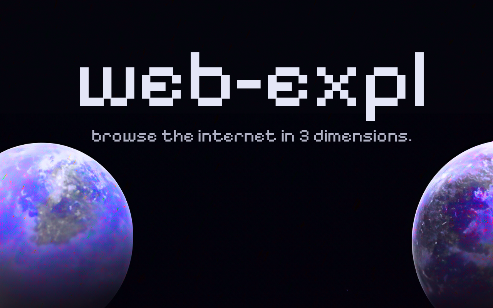

# web-expl

Explore the internet in 3-dimensional space.
Built with NextJS, TailwindCSS and ThreeJS.

## Demo
You can try out the live demo [here](https://web-expl.qwq.sh).


## Deployment

You can selfhost `web-expl` using Docker.
To deploy the scraper, run:

```bash
  docker run -p <OUTGOING_PORT>:3000 --restart=always --name web-expl ghcr.io/angelsflyinhell/web-expl
```

## Installation

Install `web-expl` with npm:

```bash
  gh repo clone angelsflyinhell/web-expl
  cd web-expl

  npm install

  npm run dev
```
